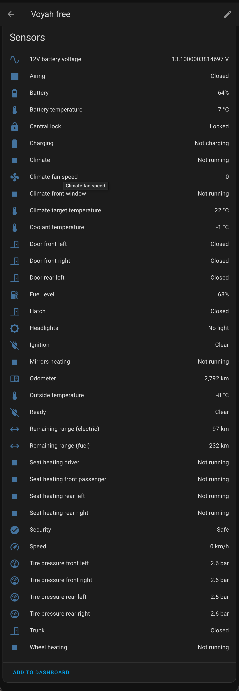
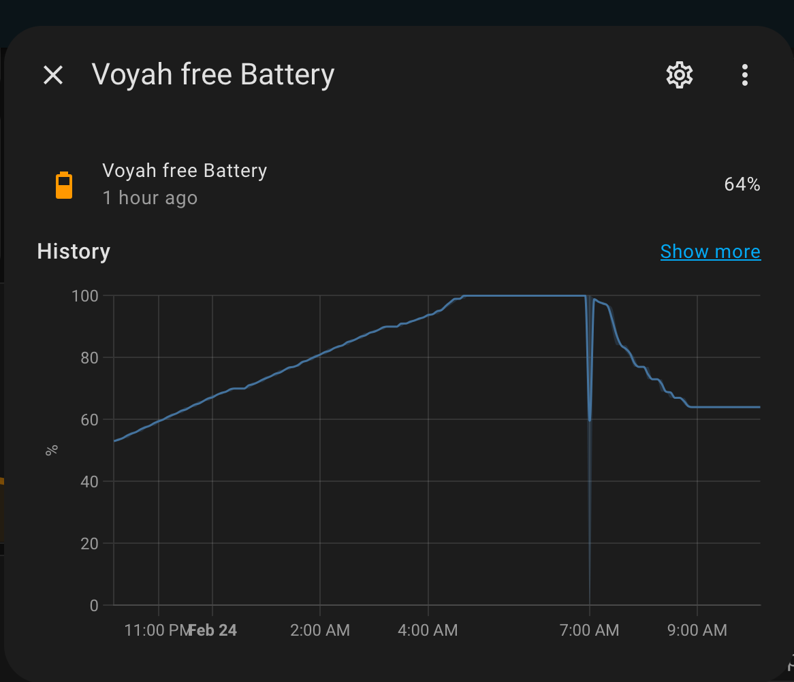
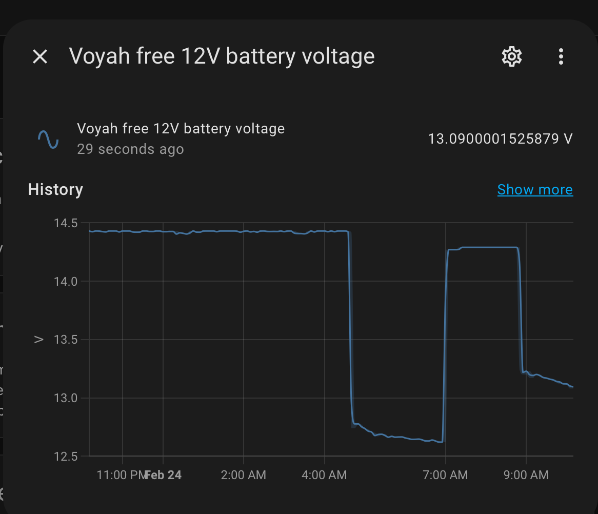

# Voyah for Home Assistant

Кастомная интеграция для [Home Assistant](https://www.home-assistant.io/), подключающаяся к облачному сервису [Voyah Assist](https://app.voyahassist.ru) для мониторинга телеметрии автомобилей Voyah.



> **[English version below](#english)**

## Возможности

### Сенсоры

| Сенсор | Единица | Описание |
|---|---|---|
| Батарея | % | Уровень заряда высоковольтной батареи |
| Запас хода (электро) | км | Расчётный запас хода на батарее |
| Уровень топлива | % | Уровень топлива в баке |
| Запас хода (топливо) | км | Расчётный запас хода на топливе |
| Напряжение 12V батареи | В | Напряжение вспомогательного аккумулятора |
| Одометр | км | Общий пробег |
| Температура снаружи | °C | Температура окружающего воздуха |
| Температура батареи | °C | Температура высоковольтной батареи |
| Температура охлаждающей жидкости | °C | Температура охлаждающей жидкости двигателя |
| Целевая температура климата | °C | Установленная температура климат-контроля |
| Скорость вентилятора климата | — | Уровень скорости вентилятора |
| Давление шин (ПЛ, ПП, ЗЛ, ЗП) | бар | Давление в каждой шине |
| Скорость | км/ч | Текущая скорость автомобиля |
| Расчётное время окончания зарядки | timestamp | Прогнозируемое время завершения зарядки (линейная экстраполяция) |

#### Расчётное время окончания зарядки — алгоритм

Сенсор оценивает, когда батарея достигнет 100%, используя скользящее окно последних 3% для расчёта текущей скорости зарядки.

1. **Начало отслеживания.** Когда `chargingStatus` переходит в `1` (или уже равен `1` при запуске Home Assistant), сенсор запоминает текущий `batteryPercentage` и временную метку `time` из ответа API как первую точку.
2. **Скользящее окно.** При каждом изменении `batteryPercentage` новая точка `(pct, time)` добавляется в буфер из 4 последних точек (= окно в 3%). Старые точки за пределами окна автоматически удаляются.
3. **Расчёт скорости.** Скорость вычисляется по крайним точкам окна:
   `rate = (newest_pct − oldest_pct) / (newest_time − oldest_time)` [% / с]
   Это отражает **текущую** скорость зарядки, а не среднюю за весь сеанс, что важно при изменении тока (tapering на высоких %, прогрев батареи и т.д.).
4. **Экстраполяция.** Оставшееся время до 100%:
   `remaining = (100 − current_pct) / rate`
   Значение сенсора — `now + remaining` (временная метка UTC), которую Home Assistant отображает как «через X ч Y мин».
5. **Пересчёт только при изменении %.** Между изменениями процента сенсор возвращает закэшированное значение — никаких лишних записей в истории.
6. **Сброс.** Когда `chargingStatus` становится `0`, буфер очищается и сенсор возвращается в состояние «неизвестно».

**Крайние случаи:**
- Первая оценка появляется после второго изменения `batteryPercentage` (нужны минимум 2 точки в окне).
- Если батарея уже на 100% или вычисленная скорость нулевая/отрицательная, сенсор показывает «неизвестно».

### Кнопки

| Кнопка | Описание |
|---|---|
| Запуск обогрева | Отправляет удалённую команду на запуск обогрева салона |

### Трекер устройства

Интеграция создаёт сущность `device_tracker`, показывающую положение автомобиля на карте Home Assistant. GPS-координаты обновляются при каждом опросе.

| Атрибут | Описание |
|---|---|
| Широта / Долгота | GPS-позиция автомобиля (отображается на карте) |
| Курс | Направление в градусах (0–360) |
| Высота | Высота над уровнем моря (метры) |
| Спутники | Количество используемых GPS-спутников |
| HDOP | Горизонтальный фактор снижения точности |
| Точность местоположения | Расчётная точность в метрах (на основе HDOP) |

### Бинарные сенсоры

| Сенсор | Описание |
|---|---|
| Зажигание | Состояние двигателя/зажигания |
| Зарядка | Идёт зарядка |
| Центральный замок | Центральный замок активен |
| Двери (ПЛ, ПП, ЗЛ) | Состояние каждой двери |
| Багажник | Багажник открыт/закрыт |
| Хэтчбек | Дверь хэтчбека открыта/закрыта |
| Климат | Климат-контроль активен |
| Охрана | Охранная система активна |
| Фары | Фары включены/выключены |
| Готовность | Состояние готовности автомобиля |
| Проветривание | Вентиляция активна |
| Обогрев лобового стекла | Обогрев лобового стекла активен |
| Обогрев зеркал | Обогрев зеркал активен |
| Обогрев руля | Обогрев рулевого колеса активен |
| Обогрев сидений (водитель, пассажир, задние Л/П) | Обогрев каждого сиденья |

### Графики истории

| Заряд батареи | Напряжение 12V батареи | Одометр |
|---|---|---|
|  |  |  |

## Установка

### HACS (рекомендуется)

1. Откройте HACS в Home Assistant
2. Перейдите в **Интеграции** → **Пользовательские репозитории**
3. Добавьте URL этого репозитория и выберите категорию **Integration**
4. Установите **Voyah**
5. Перезапустите Home Assistant

### Ручная установка

1. Скопируйте папку `custom_components/voyah` в директорию `config/custom_components/` вашего Home Assistant
2. Перезапустите Home Assistant

## Настройка

### Через интерфейс (config flow)

1. Перейдите в **Настройки** → **Устройства и службы** → **Добавить интеграцию**
2. Найдите **Voyah**
3. Введите номер телефона (формат: `79001234567`)
4. Вам придёт SMS с 4-значным кодом — введите его
5. Если у вашего аккаунта несколько организаций, выберите нужную
6. Если у вашего аккаунта несколько автомобилей, выберите нужный
7. Готово — сущности появятся автоматически

### Ручная настройка (без config flow)

Если config flow не работает (например, сервер блокирует SMS-запрос из-за капчи), можно настроить интеграцию вручную.

#### Шаг 1: Получение токенов через вспомогательный скрипт

В репозитории есть `setup_auth.py` — интерактивный скрипт для аутентификации и получения токенов.

```bash
python3 setup_auth.py
```

Скрипт:
1. Запросит номер телефона
2. Отправит SMS-код через Voyah API
3. Попросит ввести код
4. Выполнит аутентификацию и выбор организации/автомобиля
5. Выведет JSON с `car_id`, `access_token` и `refresh_token`

#### Шаг 2: Альтернатива — получение токенов через браузер

1. Откройте https://app.voyahassist.ru в Chrome/Firefox
2. Откройте DevTools (**F12** или **Cmd+Option+I**)
3. Перейдите на вкладку **Network**, включите **Preserve log**
4. Войдите с номером телефона и SMS-кодом
5. На вкладке Network найдите запрос `sign-in` (или `org/sign-in`, если выбирали организацию)
6. Откройте вкладку **Response** — скопируйте `accessToken` и `refreshToken`
7. Ваш `car_id` виден в URL любого последующего запроса, например `/car-service/car/v2/{car_id}`

#### Шаг 3: Создание записи конфигурации вручную

Добавьте следующее в файл `.storage/core.config_entries` (в массив `entries`), затем перезапустите Home Assistant:

```json
{
    "entry_id": "voyah_manual",
    "version": 2,
    "minor_version": 1,
    "domain": "voyah",
    "title": "Voyah",
    "data": {
        "phone": "79001234567",
        "access_token": "eyJhbGciOi...",
        "refresh_token": "eyJhbGciOi...",
        "car_id": "YOUR_CAR_ID",
        "car_name": "Voyah Free",
        "scan_interval": 60
    },
    "options": {},
    "pref_disable_new_entities": false,
    "pref_disable_polling": false,
    "source": "user",
    "unique_id": "voyah_YOUR_CAR_ID",
    "disabled_by": null
}
```

Замените значения:
- `phone` — номер телефона (11 цифр, без `+`)
- `access_token` — JWT access-токен из шага 1 или 2
- `refresh_token` — JWT refresh-токен из шага 1 или 2
- `car_id` — ID автомобиля из API
- `car_name` — любое отображаемое имя устройства
- `scan_interval` — интервал опроса в секундах (по умолчанию: 60)

## Аутентификация

Интеграция использует Voyah Assist API по адресу `https://app.voyahassist.ru`.

### Процесс аутентификации

| Шаг | Эндпоинт | Метод |
|---|---|---|
| Запрос SMS | `/id-service/auth/sign-up` | POST `{phone, capchaToken}` |
| Проверка кода | `/id-service/auth/sign-in` | POST `{phone, code}` |
| Выбор организации | `/id-service/org/sign-in` | POST `{orgId}` |
| Обновление токена | `/id-service/auth/refresh-token` | POST `{refreshToken}` |
| Получение данных авто | `/car-service/car/v2/{carId}` | GET |
| Запуск обогрева | `/car-service/tbox/{carId}/heating` | POST |

### Время жизни токенов

| Токен | Срок | Примечание |
|---|---|---|
| Access-токен | 10 минут | Обновляется автоматически перед каждым запросом |
| Refresh-токен | 90 дней | Новая пара выдаётся при каждом обновлении; фактически бессрочный |

Интеграция автоматически обновляет access-токен при истечении (HTTP 401) и сохраняет обновлённые токены в запись конфигурации, чтобы они переживали перезапуски Home Assistant.

Если refresh-токен истечёт (после 90 дней бездействия), потребуется повторная аутентификация — через config flow или получение новых токенов вручную.

## Решение проблем

### Ошибка «Authentication failed»

Refresh-токен истёк. Удалите интеграцию и настройте заново.

### SMS-код не приходит

API может требовать валидный токен Yandex SmartCaptcha. Используйте скрипт `setup_auth.py` или получите токены через браузер (см. Ручная настройка выше).

### Сущности показывают «недоступно»

Проверьте логи Home Assistant по слову `voyah` — обычно это означает сетевую ошибку или временную недоступность API. Интеграция повторит попытку при следующем опросе.

---

<a id="english"></a>

# English

Custom integration for [Home Assistant](https://www.home-assistant.io/) that connects to the [Voyah Assist](https://app.voyahassist.ru) cloud service to monitor Voyah vehicle telemetry.

## Features

### Sensors

| Sensor | Unit | Description |
|---|---|---|
| Battery | % | High-voltage battery charge level |
| Remaining range (electric) | km | Estimated range on battery |
| Fuel level | % | Fuel tank level |
| Remaining range (fuel) | km | Estimated range on fuel |
| 12V battery voltage | V | Auxiliary battery voltage |
| Odometer | km | Total mileage |
| Outside temperature | °C | Ambient air temperature |
| Battery temperature | °C | High-voltage battery temperature |
| Coolant temperature | °C | Engine coolant temperature |
| Climate target temperature | °C | Climate control set point |
| Climate fan speed | — | Fan speed level |
| Tire pressure (FL, FR, RL, RR) | bar | Individual tire pressures |
| Speed | km/h | Current vehicle speed |
| Estimated charging end time | timestamp | Projected completion time (linear extrapolation from observed charge rate) |

#### Estimated charging end time — algorithm

The sensor estimates when the battery will reach 100% using a sliding window of the last 3% to compute the current charge rate.

1. **Start tracking.** When `chargingStatus` transitions to `1` (or is already `1` on Home Assistant startup), the sensor records the current `batteryPercentage` and the API `time` timestamp as the first data point.
2. **Sliding window.** Each time `batteryPercentage` changes, a new `(pct, time)` point is appended to a buffer of the last 4 points (= 3% window). Points beyond the window are automatically discarded.
3. **Rate calculation.** The rate is computed from the window edges:
   `rate = (newest_pct − oldest_pct) / (newest_time − oldest_time)` [% / s]
   This reflects the **current** charge speed rather than the session average, which matters when the current changes (tapering at high %, battery warm-up, etc.).
4. **Extrapolation.** The remaining time to 100%:
   `remaining = (100 − current_pct) / rate`
   The sensor value is `now + remaining` — a UTC timestamp that Home Assistant renders as "in X h Y min".
5. **Recalculation only on % change.** Between percentage changes, the sensor returns the cached value — no redundant history entries.
6. **Reset.** When `chargingStatus` goes to `0`, the buffer is cleared and the sensor returns to "unknown".

**Edge cases:**
- The first estimate appears after the second `batteryPercentage` change (minimum 2 points needed in the window).
- If the battery is already at 100% or the computed rate is zero/negative, the sensor shows "unknown".

### Buttons

| Button | Description |
|---|---|
| Start heating | Sends a remote command to start cabin heating |

### Device Tracker

The integration creates a `device_tracker` entity that shows your car's position on the Home Assistant map. GPS coordinates are updated on every polling interval.

| Attribute | Description |
|---|---|
| Latitude / Longitude | Vehicle GPS position (shown on the map) |
| Course | Heading in degrees (0–360) |
| Altitude | Elevation above sea level (meters) |
| Satellites | Number of GPS satellites in use |
| HDOP | Horizontal dilution of precision |
| Location accuracy | Estimated accuracy in meters (derived from HDOP) |

### Binary Sensors

| Sensor | Description |
|---|---|
| Ignition | Engine/ignition state |
| Charging | Charging in progress |
| Central lock | Central locking engaged |
| Doors (FL, FR, RL) | Individual door open/closed |
| Trunk | Trunk open/closed |
| Hatch | Hatch open/closed |
| Climate | Climate control active |
| Security | Security system armed |
| Headlights | Headlights on/off |
| Ready | Vehicle ready state |
| Airing | Ventilation active |
| Climate front window | Front window defrost active |
| Mirrors heating | Mirror heating active |
| Wheel heating | Steering wheel heating active |
| Seat heating (driver, passenger, rear L/R) | Individual seat heating |

### History Charts

| Battery charge | 12V battery voltage | Odometer |
|---|---|---|
|  |  |  |

## Installation

### HACS (recommended)

1. Open HACS in Home Assistant
2. Go to **Integrations** → **Custom repositories**
3. Add this repository URL and select **Integration** as the category
4. Install **Voyah**
5. Restart Home Assistant

### Manual

1. Copy the `custom_components/voyah` folder into your Home Assistant `config/custom_components/` directory
2. Restart Home Assistant

## Configuration

### Via UI (config flow)

1. Go to **Settings** → **Devices & Services** → **Add Integration**
2. Search for **Voyah**
3. Enter your phone number (format: `79001234567`)
4. You will receive an SMS with a 4-digit code — enter it
5. If your account has multiple organizations, select one
6. If your account has multiple cars, select one
7. Done — entities will appear automatically

### Manual setup (without config flow)

If the config flow does not work (e.g. the server blocks the SMS request due to captcha), you can set up the integration manually.

#### Step 1: Obtain tokens using the helper script

The repository includes `setup_auth.py` — an interactive script that authenticates you and returns the tokens.

```bash
python3 setup_auth.py
```

The script will:
1. Ask for your phone number
2. Send an SMS code via the Voyah API
3. Ask you to enter the code
4. Authenticate and select the organization/car
5. Print a JSON with `car_id`, `access_token`, and `refresh_token`

#### Step 2: Alternative — obtain tokens from the browser

1. Open https://app.voyahassist.ru in Chrome/Firefox
2. Open DevTools (**F12** or **Cmd+Option+I**)
3. Go to the **Network** tab, enable **Preserve log**
4. Log in with your phone number and SMS code
5. In the Network tab, find the `sign-in` request (or `org/sign-in` if you selected an organization)
6. Open the **Response** tab — copy `accessToken` and `refreshToken`
7. Your `car_id` is visible in any subsequent request URL like `/car-service/car/v2/{car_id}`

#### Step 3: Create config entry manually

Add the following to your `.storage/core.config_entries` file (inside the `entries` array), then restart Home Assistant:

```json
{
    "entry_id": "voyah_manual",
    "version": 2,
    "minor_version": 1,
    "domain": "voyah",
    "title": "Voyah",
    "data": {
        "phone": "79001234567",
        "access_token": "eyJhbGciOi...",
        "refresh_token": "eyJhbGciOi...",
        "car_id": "YOUR_CAR_ID",
        "car_name": "Voyah Free",
        "scan_interval": 60
    },
    "options": {},
    "pref_disable_new_entities": false,
    "pref_disable_polling": false,
    "source": "user",
    "unique_id": "voyah_YOUR_CAR_ID",
    "disabled_by": null
}
```

Replace the values:
- `phone` — your phone number (11 digits, no `+`)
- `access_token` — JWT access token from step 1 or 2
- `refresh_token` — JWT refresh token from step 1 or 2
- `car_id` — your car's ID from the API
- `car_name` — any display name for the device
- `scan_interval` — polling interval in seconds (default: 60)

## Authentication Details

The integration uses the Voyah Assist API at `https://app.voyahassist.ru`.

### Auth flow

| Step | Endpoint | Method |
|---|---|---|
| Request SMS | `/id-service/auth/sign-up` | POST `{phone, capchaToken}` |
| Verify code | `/id-service/auth/sign-in` | POST `{phone, code}` |
| Select org | `/id-service/org/sign-in` | POST `{orgId}` |
| Refresh token | `/id-service/auth/refresh-token` | POST `{refreshToken}` |
| Get car data | `/car-service/car/v2/{carId}` | GET |
| Start heating | `/car-service/tbox/{carId}/heating` | POST |

### Token lifetimes

| Token | Lifetime | Notes |
|---|---|---|
| Access token | 10 minutes | Refreshed automatically before each request |
| Refresh token | 90 days | New pair issued on every refresh; effectively indefinite |

The integration automatically refreshes the access token when it expires (HTTP 401) and persists the updated tokens to the config entry, so they survive Home Assistant restarts.

If the refresh token itself expires (after 90 days of inactivity), you will need to re-authenticate — either via the config flow or by obtaining new tokens manually.

## Troubleshooting

### "Authentication failed" error

The refresh token has expired. Delete the integration and set it up again.

### SMS code not received

The API may require a valid Yandex SmartCaptcha token. Use the `setup_auth.py` script or obtain tokens from the browser (see Manual setup above).

### Entities show "unavailable"

Check Home Assistant logs for `voyah` — typically means a network error or the API is temporarily down. The integration will retry on the next polling interval.

## License

MIT
